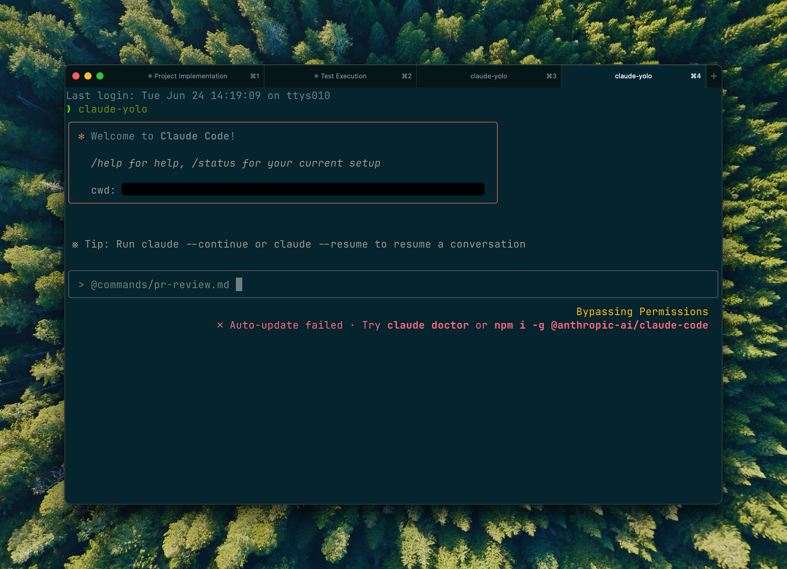
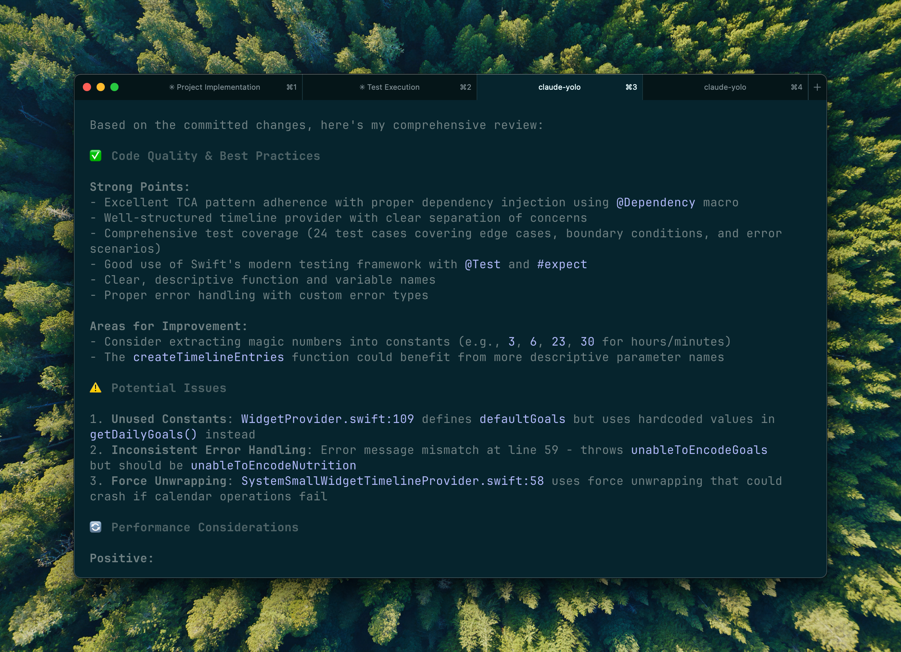

Antrophic recently released [a github integration for claude code](https://support.anthropic.com/en/articles/10167454-using-the-github-integration) that reviews your PRs. It's similar to other ones like Copilot, but I've found it to be more in-depth and catching things other agents couldn't.

However, it's quite expensive — about half a dollar per PR. I can't really justify that for a labour-of-love-style side project, so given that antrophic exposes the prompt, I've ended up copying it into a [commands/pr-review.md file](https://github.com/diegopetrucci/ai-stuff/blob/02844fc20ca3440238859b2f778f450feb309692/commands/pr-review.md).

Whenever I'm finished with a branch, I spin up a new instance of claude code, and run it via `@commands/pr-review.md`. I avoid using the same instance of CC that was making the changes to remove the context that it accumulated, kind of like having a person (that is not you) review it.

These are (part of) the results:

I am wondering if the "niceties" could be omitted and have it just focus on the potential issues, as it tends to be quite verbose, but haven't gotten around doing that. Also, it is indeed quite funny to see it rate a PR with a less than stellar rating (eg 7.5) when it was the one writing all the code.

Lastly, I do tend to relay the feedback to the instance of Claude that is writing the code. It tends to work fine, but sometimes it does need a little nudge in the right direction.
